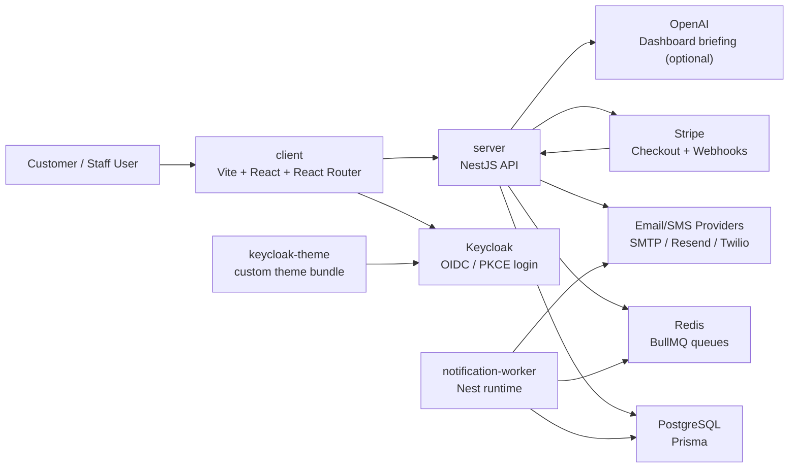
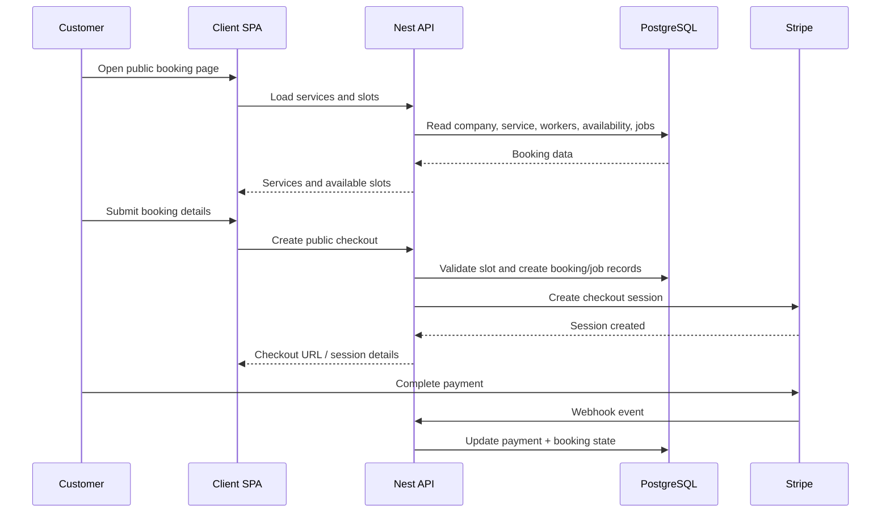
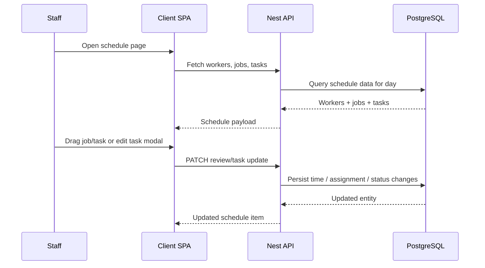

# Alex Tap Architecture

This document describes the current system shape of the Alex Tap app as it exists in this repository today.

## Overview

Alex Tap is a multi-tenant service booking and scheduling platform with:

- a public booking experience for customers
- an authenticated staff dashboard for managers and admins
- a NestJS API for business logic and integrations
- PostgreSQL for relational data
- Redis + BullMQ for background jobs
- Keycloak for authentication and role-based access
- Stripe for payment checkout and webhook-driven payment updates
- email/SMS notification infrastructure with a dedicated worker process

## Workspace Layout

```text
alex-tap/
|- apps/
|  |- client/           # Vite + React SPA
|  |- server/           # NestJS API + Prisma
|  |- keycloak-theme/   # Custom Keycloak theme app
|- .github/workflows/   # CI workflow
|- docker-compose.yml   # Local infra and worker services
|- README.md
|- Architecture.md
```

## High-Level Diagram



## Runtime Pieces

### 1. Client SPA

Location: [apps/client](C:/Users/thepr/Documents/doc-dev/dev-env-compose/alex-tap/apps/client)

The frontend is a Vite React single-page app, not a Next.js app. It uses:

- React Router for route composition
- React Query for API state and caching
- Tailwind CSS for styling
- role-aware route guards for protected dashboard pages

Main user-facing areas include:

- landing page and login entry
- public booking wizard
- booking success/cancel/access pages
- dashboard home
- schedule and task UI
- jobs, clients, alerts, settings, and activity surfaces

Key files:

- [App.tsx](C:/Users/thepr/Documents/doc-dev/dev-env-compose/alex-tap/apps/client/src/App.tsx)
- [router.tsx](C:/Users/thepr/Documents/doc-dev/dev-env-compose/alex-tap/apps/client/src/app/router.tsx)
- [BookingWizardPage.tsx](C:/Users/thepr/Documents/doc-dev/dev-env-compose/alex-tap/apps/client/src/features/booking/pages/BookingWizardPage.tsx)
- [SchedulePage.tsx](C:/Users/thepr/Documents/doc-dev/dev-env-compose/alex-tap/apps/client/src/features/schedule/pages/SchedulePage.tsx)

### 2. NestJS API

Location: [apps/server](C:/Users/thepr/Documents/doc-dev/dev-env-compose/alex-tap/apps/server)

The backend is a NestJS application that owns:

- auth callback and refresh/logout endpoints
- `/me` identity and membership resolution
- services catalog
- slots calculation
- public booking flow
- job and schedule operations
- task CRUD
- payments and Stripe webhook handling
- activity, alerts, settings, clients, and dashboard summaries
- observability and audit logging

Key files:

- [main.ts](C:/Users/thepr/Documents/doc-dev/dev-env-compose/alex-tap/apps/server/src/main.ts)
- [app.module.ts](C:/Users/thepr/Documents/doc-dev/dev-env-compose/alex-tap/apps/server/src/app.module.ts)
- [schema.prisma](C:/Users/thepr/Documents/doc-dev/dev-env-compose/alex-tap/apps/server/prisma/schema.prisma)

### 3. Database

PostgreSQL stores the core application data:

- companies, users, memberships
- workers and availability
- services
- clients
- jobs, line items, comments, assignments
- tasks and task assignments
- payments
- notifications
- alerts, activities, audit logs
- booking access links and idempotency keys

Schema source:

- [schema.prisma](C:/Users/thepr/Documents/doc-dev/dev-env-compose/alex-tap/apps/server/prisma/schema.prisma)

### 4. Queue + Worker

Redis is used for BullMQ-backed background processing.

A separate worker process handles queued notification work and related trace/log propagation.

Key files:

- [notification-worker.main.ts](C:/Users/thepr/Documents/doc-dev/dev-env-compose/alex-tap/apps/server/src/notifications/notification-worker.main.ts)
- [notification-worker.service.ts](C:/Users/thepr/Documents/doc-dev/dev-env-compose/alex-tap/apps/server/src/notifications/notification-worker.service.ts)
- [notification-queue.service.ts](C:/Users/thepr/Documents/doc-dev/dev-env-compose/alex-tap/apps/server/src/notifications/queue/notification-queue.service.ts)

### 5. Identity

Keycloak provides OIDC authentication with PKCE-based login flow. The repo also contains a custom Keycloak theme app.

Key files:

- [auth.controller.ts](C:/Users/thepr/Documents/doc-dev/dev-env-compose/alex-tap/apps/server/src/auth/auth.controller.ts)
- [jwt-auth.guard.ts](C:/Users/thepr/Documents/doc-dev/dev-env-compose/alex-tap/apps/server/src/common/guards/jwt-auth.guard.ts)
- [apps/keycloak-theme](C:/Users/thepr/Documents/doc-dev/dev-env-compose/alex-tap/apps/keycloak-theme)

### 6. External Integrations

Stripe:

- checkout sessions are created by the API
- webhook events update payment and booking state

Email/SMS:

- provider adapters exist for SMTP, Resend, and Twilio
- reminders and confirmations are routed through the notifications module

Optional AI:

- dashboard briefings can use OpenAI when enabled by env vars

## Main Request Flows

### Public Booking Flow



### Schedule and Tasks Flow



## Security and Access Model

Current implementation includes:

- Keycloak-backed JWT verification
- company-aware request context
- role-aware protected UI routes
- RBAC checks in service/controller flows
- request correlation IDs and structured logging
- persisted audit logs for key business mutations
- throttling via Nest Throttler

Notable repo reality:

- observability is implemented
- security headers and Sentry wiring are not clearly established at app bootstrap yet
- the architecture should be read as production-oriented, but not fully hardened in every area yet

## Local Infrastructure

Local development uses [docker-compose.yml](C:/Users/thepr/Documents/doc-dev/dev-env-compose/alex-tap/docker-compose.yml) to run:

- PostgreSQL
- Redis
- notification worker
- Keycloak
- Mailhog

